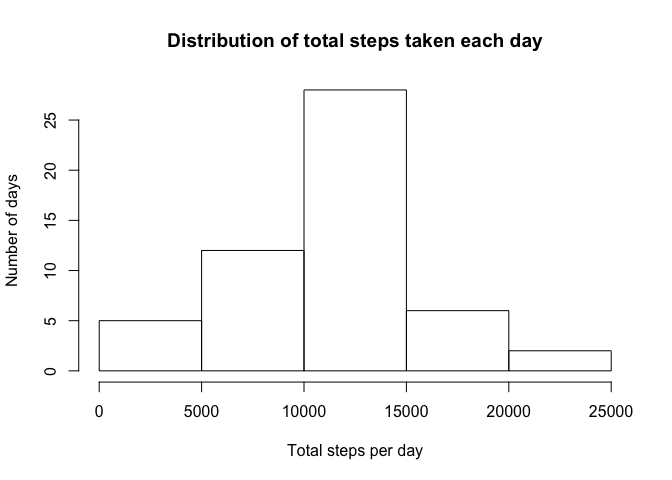
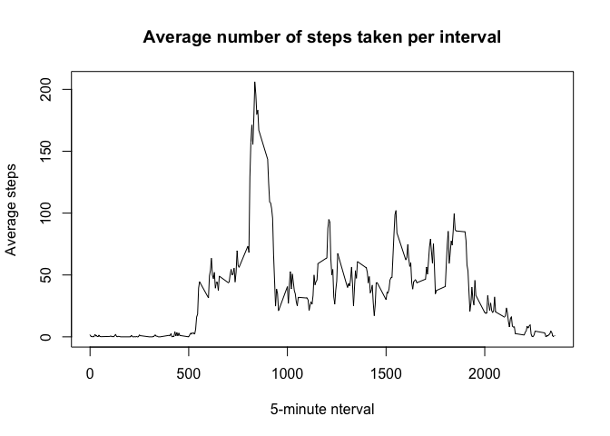
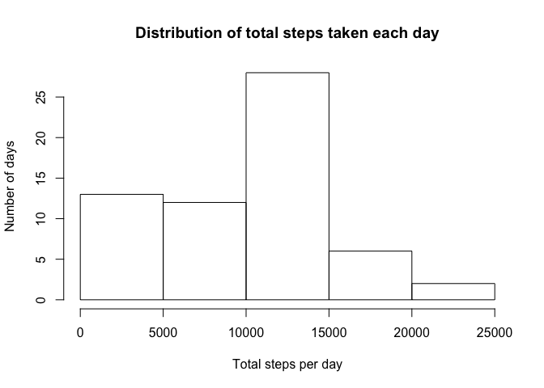
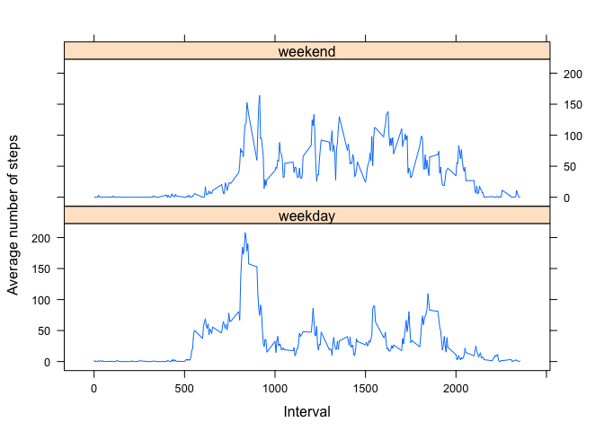

# Reproducible Research: Peer Assessment 1


## Loading and preprocessing the data

```r
# Unzip file and read in resulting csv
unzip('activity.zip')
activity <- read.csv('activity.csv')

# date read in as factor--convert to Date format
activity$date <- as.Date(activity$date)
```


## What is mean total number of steps taken per day?

```r
# Ignore missing values
act.no.na <- activity[!is.na(activity$steps),]

# Make histogram of total number of steps taken each day
steps.per.day <- aggregate(act.no.na$steps, by = list(act.no.na$date), sum, 
                           na.rm = TRUE)
hist(steps.per.day$x, xlab = "Total steps per day", ylab = "Number of days", 
     main = "Distribution of total steps taken each day" )
```

<!-- -->

```r
# Do this so that mean displayed below won't be in scientific notation
options(scipen = 999)

old.mean <- mean(steps.per.day$x)
old.median <- median(steps.per.day$x)
```

The mean total number of steps taken per day was 10766.19 and the median total number of steps taken per day is 10765.

## What is the average daily activity pattern?

<!-- -->

The five-minute interval containing the maximum number of steps on average across all days in the dataset is the one starting at interval 835.

## Imputing missing values

The total number of rows in the dataset with NAs is 2304.

We will fill in missing values with the median number of steps for each given time interval and day of the week.


```r
# Devise a strategy for filling in all of the missing values in the dataset. 
# The strategy does not need to be sophisticated. For example, you could use 
# the mean/median for that day, or the mean for that 5-minute interval, etc.

medians.by.weekday.interval <- aggregate(activity$steps, 
                                         by = list(activity$interval,
                                                   weekdays(activity$date)), 
                                         median, na.rm = TRUE)

# Create a new dataset that is equal to the original dataset but with the 
# missing data filled in.
missing.rows <- activity[!complete.cases(activity),]
missing.rows$weekday <- weekdays(missing.rows$date)
missing.rows <- merge(missing.rows, medians.by.weekday.interval, 
           by.x = c('interval', 'weekday'), 
           by.y = c('Group.1', 'Group.2'))
missing.rows <- missing.rows[,c('x', 'date', 'interval')]
colnames(missing.rows)[1] <- 'steps' 

new.data <- rbind(missing.rows, activity[complete.cases(activity),])

# Make a histogram of the total number of steps taken each day
steps.per.day <- aggregate(new.data$steps, by = list(new.data$date), sum)

hist(steps.per.day$x, xlab = "Total steps per day", ylab = "Number of days", 
     main = "Distribution of total steps taken each day" )
```

<!-- -->

```r
# Calculate and report the mean and median total number of steps taken per day.
new.mean <- mean(steps.per.day$x)
new.median <- median(steps.per.day$x)
```

The mean total number of steps taken per day was 9705.24 and the median total number of steps taken per day is 10395. 
The new mean is less than the mean total number of steps per day estimated in the first part, and the new median is less than the median estimated without the incomplete entries.


## Are there differences in activity patterns between weekdays and weekends?

```r
# Create a new factor variable in the dataset with two levels -- "weekday" and 
# "weekend" indicating whether a given date is a weekday or weekend day.
new.data$day <- as.factor(ifelse(weekdays(new.data$date) %in% c('Saturday', 'Sunday'),
                       'weekend', 'weekday'))

# Make a panel plot containing a time series plot (i.e. type = "l") of the 
# 5-minute interval (x-axis) and the average number of steps taken, averaged 
# across all weekday  days or weekend days (y-axis).
steps.per.int <- aggregate(new.data$steps, by = list(new.data$interval, 
                                                     new.data$day),
                           mean)
library(lattice)
xyplot(x~Group.1|Group.2, data = steps.per.int, type='l', xlab = "Interval",
       ylab = "Average number of steps", layout = c(1, 2))
```

<!-- -->

There tends to be more activity earlier in the day on weekdays than on weekends, especially in the period approximately between intervals 500 and 800 (presumably corresponding to 5:00 AM and 8:00AM). In both cases, the average number of steps peaks at around the same time, although the peak is higher for weekdays. On weekends, there's more activity throughout the day than on weekdays, where the main peaks likely correspond to going to work, going to lunch, going home from work, and some evening activity.
